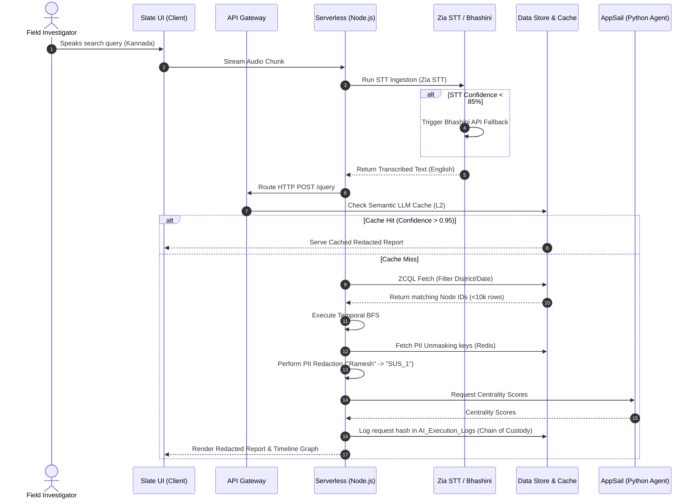

# **System Architecture & Technical Documentation**

**Project:** Intelligent Conversational AI for KSP Crime Database  
**Platform:** 100% Zoho Catalyst-Native with Modular Fallbacks  
**Compliance:** DPDP Act 2023 · ISO 27001 Alignment · Forensics Standard (BSA)

---

## **1. Core System Architecture**

The system is designed as a **decoupled, event-driven multi-agent platform**. Rather than a monolithic backend, logic is divided into modular, stateless components to prevent single-point-of-failure collapses:

```
                  ┌──────────────────────────────┐
                  │      Catalyst Slate UI       │
                  └──────────────┬───────────────┘
                                 │ HTTPS / WebSockets
                  ┌──────────────▼───────────────┐
                  │    Catalyst API Gateway      │
                  └──────────────┬───────────────┘
                                 │ Correlation ID injection
                  ┌──────────────▼───────────────┐
                  │   Catalyst Serverless API    │
                  ├──────────────────────────────┤
                  │  (Node.js Express Framework)  │
                  └──────┬──────────────┬────────┘
                         │              │
         ┌───────────────▼────────┐     │     ┌────────────────────────┐
         │     Catalyst Cache     │     ├────►│  Catalyst Data Store   │
         │ (Redis: L1/L2/PII keys)│     │     │ (Relational nodes/firs)│
         └────────────────────────┘     │     └────────────────────────┘
                                        │
         ┌────────────────────────┐     │     ┌────────────────────────┐
         │     Zia AI Services    ◄─────┼────►│   QuickML (Vector KB)   │
         │ (Kannada STT/OCR/Face) │     │     │ (Multi-Agent synthesis)│
         └────────────────────────┘     │     └────────────────────────┘
                                        │
                                        │     ┌────────────────────────┐
                                        └────►│   AppSail (Docker)     │
                                              │ (Network Analyzer Agent)│
                                              └────────────────────────┘
```

### **Architectural Modularity:**
1.  **Ingestion Layer:** Handles voice parsing (Zia STT) and scanned PDF indexing (Zia OCR). It hashes raw evidence immediately to **Catalyst Stratus** before indexing, ensuring the legal chain of custody is locked.
2.  **API Routing Layer (Serverless):** Orchestrates token decryption, PII masking, temporal graph traversal (BFS), and cache routing.
3.  **Specialist Agent Layer (AppSail):** Independent Docker containers executing heavy topological calculations (e.g., centrality analysis) to prevent memory exhaustion in the serverless layer.
4.  **Database & Cache Layer:** A relational Catalyst Data Store optimized via materialized views (L3 Cache), backed by Redis (L1/L2 Cache) for session-bound PII vaults.

---

## **2. Techstack & Architectural Decisions: Catalyst vs. Alternatives**

Because this project is built for a Datathon requiring a **100% Catalyst-native** solution, we chose Catalyst services. Below is the justification for each choice alongside the **industry-ideal alternative** if those constraints were removed:

| Catalyst Service | Purpose | Best Alternative (If not constrained) | Tech Trade-offs & Rationale |
| :--- | :--- | :--- | :--- |
| **Data Store (Relational)** | Node/Edge topology, Cases, Audit Logs | **Neo4j / TigerGraph** (Native Graph DB) | *Why Catalyst:* No native graph database exists on Catalyst. Relational is slower for multi-hop BFS. *Mitigation:* We mitigate this via L3 path materialization using nightly cron jobs and Redis (L1) BFS caching. |
| **AppSail (managed Docker)** | Heavy network analysis (Eigenvector Centrality) | **AWS ECS Fargate / Kubernetes** | *Why Catalyst:* Serverless functions timeout at 30 seconds. AppSail allows persistent execution of Python NetworkX models. *Alternative advantage:* AWS Fargate offers better autoscaling controls and GPU support. |
| **QuickML** | LLM orchestrator, Vector KB for case RAG | **Pinecone + LangChain / LlamaIndex** | *Why Catalyst:* Native vector database. *Alternative advantage:* Pinecone supports advanced hybrid sparse+dense indexing natively, whereas QuickML requires manual pre-filtering via ZCQL. |
| **Zia Services (STT / OCR)** | Kannada voice input, handwriting digitization | **OpenAI Whisper (STT) + Google Cloud Vision (OCR)** | *Why Catalyst:* Out-of-the-box Zoho API integration. *Alternative advantage:* Whisper is significantly more accurate with regional dialects. *Mitigation:* We use a Bhashini API webhook fallback when Zia STT confidence falls. |
| **Circuits** | Asynchronous Human-in-the-Loop workflows | **Temporal.io / AWS Step Functions** | *Why Catalyst:* Native visual orchestrator. *Mitigation:* Circuits timeout during human review. We implemented the **Async Hydration Pattern** (saving state to DB, terminating the circuit, re-hydrating on callback). |

---

## **3. Cross-Functional Swimlane Sequence**

This sequence diagram details the query pipeline, showcasing the PII Vault, Bhashini Fallback, and Async Hydration during a disruption simulation:



---

## **4. Core User Flows**

### **User Flow A: Conversational Crime Search (Field Officer)**
1.  **Input:** Officer taps the microphone button on the Slate UI and speaks: *"Find case details of Ramesh in Mysore who committed theft in 2024."*
2.  **Transcription & Translation:** The audio is uploaded, hashed, and sent to Zia STT. The transcription is translated to English.
3.  **Intent Classification:** The Router Agent classifies the intent as `SEARCH` and extracts filters: `{ district: "Mysore", category: "Theft", year: "2024" }`.
4.  **Legal Ontology Check:** The system maps the legal section: Theft (IPC 379) is mapped to Theft (BNS 303) [KNOWN].
5.  **PII Redaction:** The Serverless function fetches the matching FIR, replaces the name "Ramesh" with `SUS_1` using a session-bound Redis key, and writes a log with the audit chain hash.
6.  **Output:** Slate UI displays the redacted case file and plays back a Kannada translation via Zia TTS.

### **User Flow B: Network Disruption Simulation (Supervisor)**
1.  **Selection:** Supervisor views a D3.js connection graph and clicks on a key suspect node (`SUS_1`).
2.  **Simulation Request:** Supervisor clicks *"Simulate Removal Impact"*.
3.  **Disclaimer Prompt:** The Slate UI displays a legal warning regarding the predictive nature of police AI. The workflow pauses (Async Hydration).
4.  **Authorization:** Supervisor inputs their PIN. This fires a resume POST request to the API Gateway.
5.  **Compute:** AppSail recalculates centrality metrics for the remaining nodes, simulating the gang's network collapse.
6.  **Output:** Slate UI renders a comparison showing the network before and after the simulated arrest.

---

## **5. Robust Error Logging & Auditing Design**

To ensure forensic logs are admissible in a court of law under the **Bharatiya Sakshya Adhiniyam (BSA)**, we implement a cryptographic log chain:

1.  **UUID Correlation ID:** Generated at the API Gateway for every request and passed in headers (`X-Correlation-ID`) across all microservices (Serverless, AppSail, Zia).
2.  **Hash Chaining:** Every row inserted in `AI_Execution_Logs` contains the SHA-256 hash of the current log fields combined with the hash of the *previous* row.
    $$\text{Signature}_N = \text{SHA256}(\text{LogData}_N + \text{Signature}_{N-1})$$
    If any record is altered, deleted, or inserted out of order, the signature chain breaks, instantly alerting SREs.
3.  **Detailed Error JSON:** All system errors return a structured payload:
    ```json
    {
      "correlation_id": "8f9a2b7c-3d4e-5f6a-7b8c-9d0e1f2a3b4c",
      "error_code": "DB_BFS_TIMEOUT",
      "message": "The graph traversal exceeded the 5000ms SLA limit.",
      "severity": "HIGH",
      "fallback_active": true
    }
    ```

---

## **6. Fallback Mechanisms**

| Component | Failure Mode | Trigger | Fallback Action |
| :--- | :--- | :--- | :--- |
| **Zia STT** | Kannada dialect parsing error / Timeout | Word error rate >15% or Zia returns 500 | Pipeline redirects the audio binary to the Bhashini API webhook. |
| **AppSail Agent** | Container crash / CPU throttling | HTTP status 502/504 from AppSail | Serverless activates `FALLBACK_BASIC_MODE`, bypassing centrality graphs and performing basic keyword-only search. |
| **QuickML Vector** | API Rate limits (DDoS / High concurrency) | HTTP status 429 from QuickML | Query is placed in the Redis FIFO Queue. UI displays: *"AI under heavy load. Processing queue: Position X."* |
| **Data Store** | Database lock / Read replica delay | Query execution >3000ms | System reads from L1/L2 Redis caches (stale data approved up to 4 hours). |
